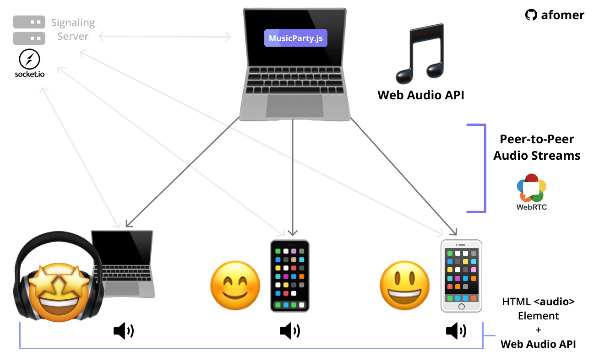
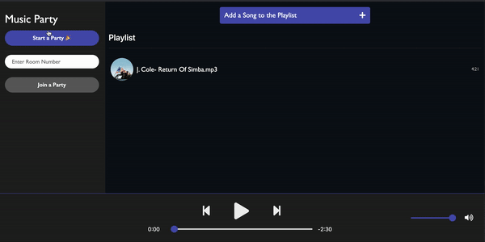
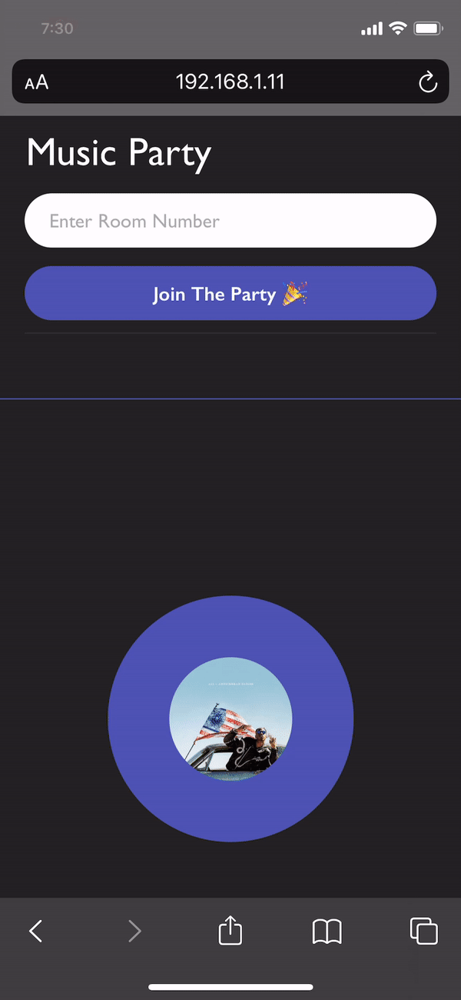

<p align="center">
    
</p>

<h1 align="center">
Cross-Platform Music Parties in the Browser 🎧
</h1>

<p align="center">
Cross-Platform Realtime Audio Sharing through the Browser using <strong>WebRTC</strong>, and <strong>Web Audio API</strong>!
</p>
<br/>
<br/>

<br/>
<br/>
<h1>
Demo
</h1>
<br/>
<br/>

Macbook (Chrome 86)           |  iPhone 11 (Mobile Safari)
:-------------------------:|:-------------------------:
  | 

<br/>
<br/>
<h1>
Using the Code!
</h1>
<h2>
The Client
</h2>
<h4>
Host
</h4>
<p>

```
Open index.html in your favorite browser
```
</p>
<h4>
Listener
</h4>
<p>

```
Open listener.html in your favorite browser
```
</p>


<h2>
The (Signaling) Server
</h2>
<p>

```bash
git clone https://github.com/afomer/music-party

cd backend

npm install

node server.js
```
</p>
